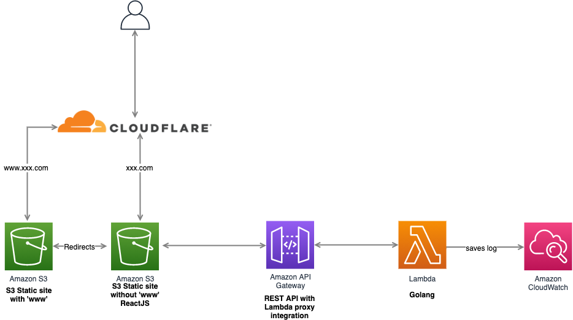

# k2tf web

An online tool for converting Kubernetes API Objects (in YAML format) into HashiCorp's Terraform configuration language.



## Build

Under `back-go` directory, run

```bash
  GOOS=linux GOARCH=amd64 go build -o main main.go
  zip main.zip main
```
Under `infra-aws` directory, first replace `site_domain` in terraform.tfvars with your own domain, then run

```bash
  terraform init
  terraform apply
```
this deploy your backend code and infra to run it


## Deployment

First you will need to replace the api url with your API Gateway end url in `front-react/src/App.js`

To build the frontend code, under `front-react` directory, run

```bash
  npm run build
```
To deploy the frontend code, run
```bash
  aws s3 sync build/ s3://$YOUR_SITE_DOMAIN --acl public-read
```

    